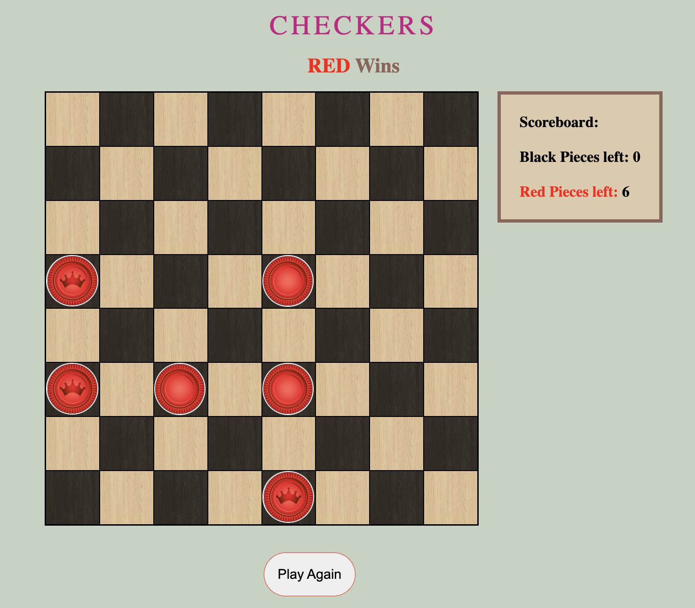

# Checkers
My game is checkers. Two players locally play on a 8x8 grid. Players move thier piece diagonally and the player who runs out of pieces loses. There is a kinging implementation and players retain thier turn after taking an enemy piece. A player may also choose to surrender if they cannot move anymore.

# Screenshots

# Technologies Used

- JavaScript
- HTML
- CSS

# Getting Started

- [GitHub Pages](https://gerardoap22.github.io/checkers-browser-game/)

# Game Instructions
- Player chooses what piece they want to move. That piece will have a yellow border color.
- Click on the diagonal that they wish to move to.
- If the player wants to reselect the piece they want to move, click the inital piece again to remove the yellow border color. Click the new piece.
- A player can only capture a piece if there is an avaialble space after the enemy piece.
- When a player's checker piece gets to the end of the board (respectively), the piece will become a king piece.
- King pieces are allowed to go backkwards as well as forward.
- Game will end when a player loses all thier pieces or a player clicks the surrender button.

# Next Steps

There are a few enhancements that can be implemented into the game:
- Create a start page and a Modal after a win.
- Add background music for throughout the game.
- Implement a drag and drop functions to allow another way to move pieces. 

# Sources

- Maple Light Wood Image: https://www.sketchuptextureclub.com/textures/architecture/wood/fine-wood/light-wood/maple-light-wood-fine-texture-seamless-04301
- Dark Oak Image: https://www.sketchuptextureclub.com/textures/architecture/wood/fine-wood/dark-wood/oak-moka-fine-wood-pbr-texture-seamless-22007
- Checker Pieces Images: https://stock.adobe.com/search?k=checkers+piece&asset_id=249920338
- King Upgrade Sound (Game Bonus by: UNIVERSFIELD): https://pixabay.com/sound-effects/search/notification/ 
- Take Piece Sound (take-it by: Pixabay): https://pixabay.com/sound-effects/search/take/ 
- Move Piece Sound:  https://pixabay.com/sound-effects/search/animation/ 